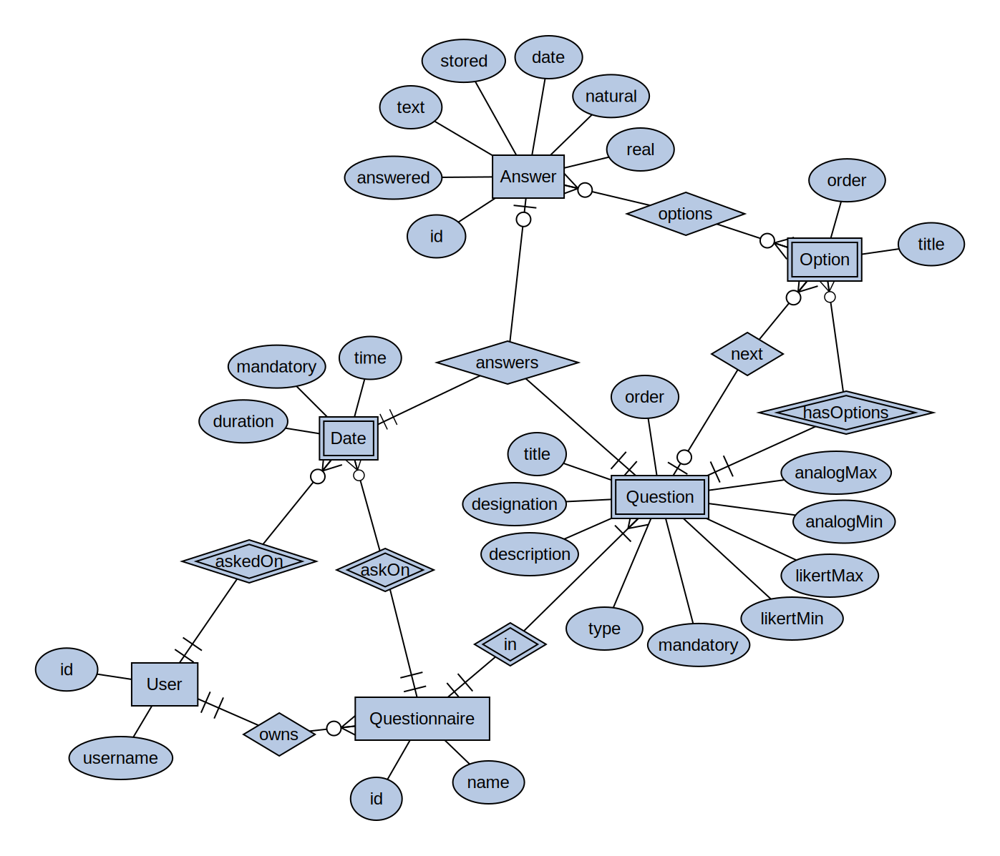

# Befragungen [ENTWURF]

## I. Anforderungen

Folgende allgemeine Anforderungen sollen erfüllt werden:

1. Erstellen von Fragebögen mit benutzerfreundlichem GUI durch Therapeuten in Therapeuten UI.
2. Import und Export von Fragebögen durch Therapeuten in Therapeuten UI.
3. Beantwortung von Fragebögen durch Patienten in Patienten UI.
4. Export von Antworten durch Therapeuten in Therapeuten UI als .CSV-Datei.
5. Speicherung von Fragebögen und Antworten in IMeRa.
6. Therapeut soll Zeitplan erstellen können, wann welche Fragebögen an welchen Patienten gestellt werden.
7. Fragebögen sollen von Therapeut auch ohne Zeitplan an Patienten gestellt werden können.
8. Fragebögen sollen wiederholt gestellt werden können.
9. Einzelne Fragen sollen überspringbar sein.
10. Fragen sollen abhängig von Antwort auf vorherige Fragen automatisch übersprungen werden.

Für die Fragen sollen folgende Antwortformate möglich sein:

1. Multiple Choice
2. Single Choice
3. Likert-Skala
4. Visualle Analog-Skala
5. Freitext
6. Zahlen
7. Datum

## II. Umsetzung

### 1. Datenbank

Die Speicherung der Fragebögen und Antworten wird im folgenden Entity Relation Diagramm beschrieben:



Die Entitäten werden im folgenden genauer erläutert:

#### 1.1. User

Implementiert die berechtigten Benutzer und weist den Benutzernamen aus dem SSO eine interne ID zu.
Benutzer können sowohl Therapeuten, als auch Patienten sein.

Die Entität enthält folgende Attribute:

##### id

**Datentyp:** `INT NOT NULL AUTO_INCREMENT`

Beschreibt die intern verwendete ID für den Benutzer.
Sie ist eindeutig und wird beim hinzufügen des Benutzers automatisch mit einer Laufzahl generiert.

Die ID ist der `PRIMARY KEY` der User Entität.

Die ID sollte niemals außerhalb der Datenbank verwendet werden.
Wird auf den Benutzer von außerhalb referenziert, so geschieht dies immer mit dem Attribut `username`.

##### username

**Datentyp:** `VARCHAR(255) NOT NULL`

Beschreibt den Benutzernamen des Benutzers, welcher auch vom Single-Sign-On verwendet wird.

Benutzernamen sind eindeutig, es gilt also folgender Constraint: `UNIQUE (username)`.

Der Username ist außerdem indiziert werden, da dieser über die REST-Schnittstelle kommuniziert wird.

#### 1.2. Questionaire

Implementiert den Fragebogen.

Ein Fragebogen ist eindeutig einem Patienten zuzuordnen.
Daraus ergibt sich die Many-to-One Relation `owns`, welche mittels eines `FOREIGN KEY` Constraints auf das Attribut `id` der Entität `User` verweist.

Die Entität enthält außerdem folgende Attribute:

##### id

**Datentyp:** `INT NOT NULL AUTO_INCREMENT`

Beschreibt die interne ID des Fragebogens.

Die ID ist der `PRIMARY KEY` der Questionaire Entität.

##### name

**Datentyp:** `VARCHAR(255) NOT NULL`

Beschreibt den Namen, den der Therapeut vergibt.
Dieser Name ist nur für den Therapeuten sichtbar.

Der Name ist für jeden Therapeuten eindeutig, es gilt also folgender Constraint: `UNIQUE (User.id, Questionaire.name)`.

#### 1.3. Question

Implementiert einzelne Fragen eines Fragebogens.

Eine Frage wird eindeutig einem Fragebogen zugewiesen.
Daraus ergibt sich die Many-to-One Relation `in`, welche mittels eines `FOREIGN KEY` Constraints auf das Attribut `id` der Entität `Questionaire` verweist.

Die Entität enthält außerdem folgende Attribute:

##### order

**Datentyp:** `INT NOT NULL`

Beschreibt die Reihenfolge, in welcher die Frage im Fragebogen gestellt werden soll.

Die Reihenfolge soll von dem Therapeuten festgelegt werden können.

Eine Frage ist eindeutig durch die Attribute `Question.order` und `Questionaire.id` identifizierbar.
Daraus ergibt sich folgender Constraint, welcher auch als `PRIMARY KEY` für die Entität `Question` verwendet wird: `UNIQUE (Question.order, Questionaire.id)`.

##### designation

**Datentyp:** `VARCHAR(255) NOT NULL`

Beschreibt die Bezeichnung der Frage, die der Therapeut frei festlegen kann.
Diese Bezeichnung ist nur für den Therapeut sichtbar.

Die Bezeichnung einer Frage ist für jeden Fragebogen eindeutig, es gilt also folgender Constraint: `UNIQUE (Questionaire.id, Question.designation)`.

##### title

**Datentyp:** `TEXT NOT NULL`

Beschreibt den Titel der Frage, welcher dem Patienten angezeigt werden soll.

##### description

**Datentyp:** `TEXT DEFAULT NULL`

Beschreibt die optionale Beschreibung einer Frage, welche dem Patienten zur genaueren Erläuterung der Fragestellung dienen soll.

##### mandatory

**Datentyp:** `BOOLEAN NOT NULL DEFAULT 1`

Beschreibt, ob der Patient auf die Frage eine Antwort geben muss.
Wird die Frage basierend auf einer Auswahlmöglichkeit automatisch übersprungen, so muss sie optional sein.

##### type

**Datentyp:** `AnswerType NOT NULL`

Beschreibt die Art des Antworttyps.

Der Datentyp `AnswerType` ist eine Enummeration, die folgende Werte annehmen kann:

* `as` = Analog Scale
* `dt` = Date Time
* `ft` = Free Text
* `ls` = Likert Scale
* `mc` = Multiple Choice
* `rn` = Real Number
* `sc` = Single Choice

##### likertMin

**Datentyp:** `INT DEFAULT NULL`

Beschreibt den Mindestwert auf einer Likert-Skala.
Ist nur definiert, wenn das Attribut `type` den Wert `ls` aufweist.

##### likertMax

**Datentyp:** `INT DEFAULT NULL`

Beschreibt den Maximalwert auf einer Likert-Skala.
Ist nur definiert, wenn das Attribut `type` den Wert `ls` aufweist.

##### analogMin

**Datentyp:** `DOUBLE DEFAULT NULL`

Beschreibt den Mindestwert auf einer visuellen Analog-Skala.
Ist nur definiert, wenn das Attribut `type` den Wert `ls` aufweist.

##### analogMax

**Datentyp:** `DOUBLE DEFAULT NULL`

Beschreibt den Maximalwert auf einer visuellen Analog-Skala.
Ist nur definiert, wenn das Attribut `type` den Wert `ls` aufweist.

#### 1.4. Option

Implementiert die möglichen Antworten auf von Multiple Choice oder Single Choice Fragen.

Mit der Many-to-One Relation `hasOptions` verweist die Entität auf die zugehörige Frage.
Referenziert wird mittels `FOREIGN KEY`s auf den `PRIMARY KEY` der Entität `Question` mit den Attributen `(Questionaire.id, Question.order)`.

Mit der Many-to-One Relation `next` verweist die Entität auf die Frage, welche nach der Beantwortung mit dieser Option als nächstes gestellt werden soll.
Hierfür wird mittels eines `FOREIGN KEY`s auf das Attribut `order` der Entität `Question` referenziert.
Die Relation wird außerdem mit `ON UPDATE CASCADE` versehen, um die Referenzen beizubehalten, sollte sich das `order` Attribut der referenzierten `Question` ändern.
Das Attribut `next` muss außerdem größer sein, als das Attribut `order` der im `PRIMARY KEY` referenzierten Frage, zu welcher diese Option gehört und ist standardmäßig um `1` höher, sodass auf die nächste Frage referenziert wird.

Die Entität verfüg außerdem über folgende Attribute:

##### order

**Datentyp:** `INT NOT NULL`

Beschreibt die Reihenfolge, in welcher die Option angezeigt werden soll.

Zusammen mit den `FOREIGN KEY`s, welche auf die Entität `Question` referenzieren, bildet dieses Attribut den `PRIMARY KEY` mit den Attributen `(Questionaire.id, Question.order, Option.order)`.

##### title

**Datentyp:** `TEXT NOT NULL`

Beschreibt den angezeigten Titel der Option.

Dieser Titel muss `UNIQUE` für die Optionen einer Frage sein. Daraus ergibt sich folgender Constraint: `UNIQUE (Questionaire.id, Question.order, Option.title)`.

#### 1.5. Date

Implementiert den Termin des Stellen eines Fragebogens durch den Therapeuten an den Patienten.

Mit der Many-to-One Relation `askOn` verweist die Entität auf den zugehörigen Fragebogen, der damit gestellt werden soll.
Referenziert wird mittels eines `FOREIGN KEY`s auf das Attribut `id` der Entität `Questionaire`.

Mit der Many-to-One Relation `askedOn` verweist die Entität auf den Patienten, der an diesem Zeitpunkt gefragt werden soll.
Referenziert wird mittels eines `FOREIGN KEY`s auf das Attribut `id` der Entität `User`.

Die Entität verfügt außerdem über folgende Attribute:

##### time

**Datentyp:** `DATETIME NOT NULL`

Beschreibt den Zeitpunkt, an dem der Fragebogen gestellt werden soll.

Zusammen mit den `FOREIGN KEY`s bildet dieses Attribut den Constraint `UNIQUE (User.id, Questionaire.id, Date.time)`. Zusammen bilden diese Attribute den `PRIMARY KEY` der Entität `Date`.

##### duration

**Datentyp:** `TIMESPAN DEFAULT NULL`

Beschreibt die Dauer, wie lange der Patient Zeit hat, den referenzierten Fragebogen zu beantworten.

##### mandatory

**Datentyp:** `BOOLEAN NOT NULL DEFAULT 1`

Beschreibt, ob der Fragebogen während der Dauer der Zeitspanne `duration` beantwortet werden muss (`1`) oder auch spätere Antworten noch zulässig sind (`0`).

#### 1.6. Answer

Implementiert die Antwort auf eine gestellte Frage.

Mit der One-to-One Relation `answers`, welche auf die `Date` Entität verweist, kann die Antwort eindeutig einer gestellten Frage zugeordnet werden.
Referenziert wird dabei mit `FOREIGN KEY`s auf den `PRIMARY KEY` der Entität `Date`, wodurch eindeutig auf den Zeitpunkt, an dem die Frage gestellt wurde (`Date.time`), den Patienten, welcher die Frage beantwortet hat (`User.id`) und den Fragebogen (`Questionaire.id`) referenziert.
Außerdem wird mit einem `FOREIGN KEY` auf das Attribut `id` der Entität `Question` referenziert, um der Antwort eine eindeutige Frage zuordnen zu können.
Daraus ergibt sich folgender Constraint: `UNIQUE (User.id, Questionaire.id, Question.order, Date.time)`, welcher den `PRIMARY KEY` der Entität bildet.

Zusätzlich kann die Entität mit einer optionalen One-to-Many Relation `options` auf die Entität `Option` referenzieren.
Dies ist nur dann der Fall, wenn das Attribut `type` der referenzierten Entität `Question` den Wert `mc` (= Multiple Choice) aufweist.
Weist das Attribut `type` der referenzierten `Question` den Wert `sc` (= Single Choice) auf, so handelt es sich stattdessen um eine One-to-One Relation.
Bei beiden Relationen wird mit `FOREIGN KEY`s auf die Attribute `(Option.order, Question.order, Questionaire.id)` verwiesen.

Die Entität verfügt außerdem über folgende Attribute:

##### stored

**Datentyp:** `DATETIME NOT NULL DEFAULT CURRENT_TIMESTAMP`

Beschreibt den Zeitpunkt, an welchem die Antwort in die Datenbank eingetragen wurde.

##### answered

**Datentyp:** `DATETIME NOT NULL`

Beschreibt den Zeitpunkt, an welchem die Antwort laut Patienten App gegeben wurde.

*Dieser Wert könnte manipuliert sein, ist aber für das Offline-Caching notwendig, weshalb als vertrauenswürdiger Wert das Attribut `stored` verwendet wird.*

##### real

**Datentyp:** `DECIMAL DEFAULT NULL`

Beschreibt einen reellen Zahlenwert, welcher aus der visuellen Analog-Skala (`as`) oder einem Zahlenwert (`rn`) stammt.

Dieses Attribut hat immer dann den Wert `NULL`, wenn das Attribut `type` der referenzierten Frage nicht den Wert `as` oder `rn` annimmt.
Ansonsten darf es nicht den Wert `NULL` annehmen.

##### date

**Datentyp:** `DATETIME DEFAULT NULL`

Beschreibt den Wert des angegebenen Zeitpunkts.

Dieses Attribut hat immer dann den Wert `NULL`, wenn das Attribut `type` der referenzierten Frage nicht den Wert `dt` annimmt.
Ansonsten darf es nicht den Wert `NULL` annehmen.

##### natural

**Datentyp:** `INT DEFAULT NULL`

Beschreibt einen natürlichen Zahlenwert, welcher aus einer Likert-Skala (`ls`) stammt.

Dieses Attribut hat immer dann den Wert `NULL`, wenn das Attribut `type` der referenzierten Frage nicht den Wert `ls` annimmt.
Ansonsten darf es nicht den Wert `NULL` annehmen.

##### text

**Datentyp:** `TEXT DEFAULT NULL`

Beschreibt die gegebene Freitext-Antwort.

Dieses Attribut hat immer dann den Wert `NULL`, wenn das Attribut `type` der referenzierten Frage nicht den Wert `ft` annimmt.
Ansonsten darf es nicht den Wert `NULL` annehmen.

### 2. Import, Export und REST API

#### 2.1. Fragebögen Definition

Fragebögen sollen im JSON-Format (JavaScript Object Notation) repräsentiert werden.

Das Therapeuten UI enthält einen Editor für Fragebögen mit einer benutzerfreundlichen Oberfläche, welche es ermöglicht, sich schnell und einfach Fragebögen zusammen zu klicken.
Dabei wird ein JavaScript Object erstellt, welches ins JSON-Format geparst wird und so als "Download" exportiert oder an IMeRa über eine REST Schnittstelle als POST-Body hochgeladen werden kann.

Auf der Server-Seite von IMeRa wird der JSON-String geparst und mit dem in II.1. beschriebenen Format in die Datenbank eingepflegt.

Basierend auf dem Benutzernamen des Patienten und der Uhrzeit können über einen GET-Endpoint von IMeRa die Fragebögen in fast identischem Format für den Patienten durch das Patienten UI abgerufen werden.

Der Aufbau des JavaScript Objects ist wie folgt:

```json
{
  "id": 1,
  "name": "FB1",
  "from": "therapist1",
  "time": "2020-05-22T12:00:00Z",
  "q": {
    "1": {
      "designation": "FB1-q1",
      "title": "Ist etwas davon passiert?",
      "type": "mc",
      "mandatory": true,
      "options": {
        "1": {
          "title": "Mir ging es schlecht",
          "next": 2
        },
        "2": {
          "title": "Mir ging es gut",
          "next": 3
        },
      }
    },
    "2": {
      "designation": "FB1-q2",
      "title": "Wie schlecht ging es Ihnen?",
      "description": "Sie können hier alles wählen!",
      "type": "ls",
      "mandatory": false,
      "min": 1,
      "max": 5
    },
    "3": {
      "designation": "FB1-q3",
      "title": "Hat der Fragebogen Spaß gemacht?",
      "type": "sc",
      "mandatory": true,
      "options": {
        "1": {
          "title": "Ja"
        },
        "2": {
          "title": "Nein"
        }
      }
    }
  }
}
```

Die Parameter werden im Folgenden erläutert:

##### id

Entspricht der ID des Fragebogens, welche bereits in II.1.2. beschrieben wurde.

##### name

Entspricht dem Attribut `name` des Fragebogens, welches bereits in II.1.2. beschrieben wurde.

*Dieser Parameter wird nur beim Import/Export und bei der Übertragung des Fragebogens von dem Therapeuten UI an IMeRa benötigt!*

##### from

Entspricht dem Benutzernamen des Therapeuten, welcher die Frage erstellt hat.

*Dieser Parameter wird nur bei der Übertragung des Fragebogens an den Patienten benötigt!*

##### time

Entspricht dem Zeitpunkt, an welchem die Frage gestellt wurde.
Er entspricht dem Attribut `time` des in II.1.5. beschriebenen Termins.
Die Uhrzeit wird dabei als ISO-8601 kodierter UTC timestamp kodiert.

*Dieser Parameter wird nur bei der Übertragung des Fragebogens an den Patienten benötigt!*

##### q

Ein Object, welches die einzelnen Fragen repräsentiert.
Dabei entspricht der Name der Attribute der `order` des in II.1.3. beschriebenen Reihenfolge der Fragen.

##### q.[order].designation

Entspricht der Bezeichnung der Frage, welche mit dem Attribut `designation` in II.1.3. beschrieben ist.

*Dieser Parameter wird nur beim Import/Export und bei der Übertragung des Fragebogens von dem Therapeuten UI an IMeRa benötigt!*

##### q.[order].title

Entspricht dem Titel der Frage, welcher mit dem Attribut `title` in II.1.3. beschrieben ist.

##### q.[order].description

Entspricht der optionalen Beschreibung der Frage, welcher mit dem Attribut `description` in II.1.3. beschrieben ist.

##### q.[order].type

Entspricht dem Typ der Frage, welcher mit dem Attribut `type` in II.1.3. beschrieben ist.

##### q.[order].mandatory

Ein boolscher Wert, welcher angibt, ob die Frage beantwortet werden muss.
Entspricht dem Attribut `mandatory` aus II.1.3.

##### q.[order].min

Mindestwert der Likert- oder Analog-Skala.
Entspricht dem Attribut `likertMin`, bzw. `analogMin` aus II.1.3.

##### q.[order].max

Maximalwert der Likert- oder Analog-Skala.
Entspricht dem Attribut `likertMax`, bzw. `analogMax` aus II.1.3.

##### q.[order].options

Ein Objekt, welches bei Single- oder Multiple-Choice Fragen die Antwortmöglichkeiten an.
Dabei entspricht der Name der Attribute der `order` der in II.1.4. beschriebenen Option.

##### q.[order].options.[order].title

Entspricht dem Attribut `title` der in II.1.4. beschriebenen Option.

##### q.[order].options.[order].next

Gibt die Frage an, welche beim Beantworten mit dieser Option als nächstes gestellt werden soll.

Ist der Wert nicht gesetzt, so geht es mit der nächsten Frage weiter oder, falls dies die letzte Frage war, der Fragebogen beendet.

Bei Multiple Choice Fragen wird der kleinste ausgewählte Wert verwendet.

Der Wert entspricht dem Attribut `order` der in II.1.3. beschriebenen Frage, welcher dem Attribut `q.[order]` entspricht.

#### 2.2. Antworten

Antworten werden im JSON-Format als POST-Body an die REST-API von IMeRa übergeben werden.

Das Patienten UI generiert die Antwort-Objekte bei der Beantwortung eines Fragebogens und sendet nach Abschluss des Fragebogens die Antworten aller Fragen gesammelt als ein JSON-Objekt an IMeRa.

Der IMeRa REST Endpoint speichert die Antworten in dem in II.1. beschriebenen Format in die Datenbank.

Ein solches Antwort Objekt sieht wie folg aus:

```json
{
  "id": 1,
  "from": "therapist1",
  "time": "2020-05-22T12:00:00Z",
  "answered": "2020-05-22T12:53:24Z",
  "a": {
    "1": [1],
    "2": 4,
    "3": 1
  }
}
```

Die Parameter werden im Folgenden erläutert:

##### id

Entspricht der Identität des Fragebogens.

##### from

Entspricht dem Benutzernamen des Therapeuten, welcher die Frage gestellt hat.

##### answered

Zeitpunkt, an dem der Fragebogen auf Seite des Patienten UIs abgeschlossen wurde als UTC-Timestamp im ISO-8601 Format.

##### a

Ein Objekt, welches als Attribut-Keys den `order` Wert einer Frage des Fragebogens enthält und als Attribut-Value den Wert der gegebenen Antwort.

Der Attribut-Value ist dabei abhängig von dem Typ der Frage:

* `as`: Angegebener `number` Wert auf Analog Skala.
* `dt`: Angegebener ISO 8601 kodierter UTC-Timestamp als `string` Wert.
* `ft`: Angegebener `string` Wert des Freitextes.
* `ls`: Angegebener `number` auf Likert-Skala.
* `mc`: Array von angegebenen `order`-Werten (number) der Multiple Choice Optionen.
* `rn`: Angegebene `number` Wert einer Real Number.
* `sc`: Angegebener `order`-Wert (number) der gewählten Single Choice Option.

Wurde eine Frage nicht beantwortet, wird die Antwort auch nicht als Attribut des Objekts `a` dargestellt.

#### 2.3. Export von Antworten

Mit dem Therapeuten UI können die Antworten aller Patienten auf einen vom Therapeuten ausgewählten Fragebogen über eine REST API von IMeRa im .CSV-Format (Comma Separated Values) heruntergeladen werden.

Eine solche Datei lässt sich als Tabelle wie folgt repräsentieren:

| user     | asked                | answered             | stored               | FB1-q1 | FB1-q2 | FB1-q3 |
|----------|----------------------|----------------------|----------------------|--------|--------|--------|
| patient1 | 2020-05-22T12:00:00Z | 2020-05-22T12:53:24Z | 2020-05-22T12:54:13Z | 01     | 4      | 1      |
| patient2 | 2020-05-22T12:00:00Z | 2020-05-22T12:23:55Z | 2020-05-22T12:24:12Z | 10     | 3      | 2      |

Dabei entspricht die Spalte

* `user` dem `username` des Patienten, dessen Antwort in der Zeile repräsentiert werden soll.
* `asked` dem Zeitpunkt, an welchem die Frage gestellt wurde.
* `answered` dem Zeitpunkt, an welchem laut Patienten UI die Frage beantwortet wurde.
* `stored` dem Zeitpunkt, an welchem die Antwort in der Datenbank gespeichert wurde.

Die darauf folgenden Spalten entsprechen der Bezeichnung der Frage, welche dem Attribut `designation` aus II.1.3. entsprechen.
Die Werte der einzelnen Zeilen unter diesen Spalten entsprechen der gegebenen Antwort.

Bei Single Choice Fragen entspricht der Wert dem Attribut `order` der gegebenen Antwort.

Bei Multiple Choice Fragen ist der Wert als eine Sequenz von Wahrheitswerten (`1` = `true`, `0` = `false`) zu interprätieren, deren Reihenfolge der der `order` Attribute entspricht.
Bei den Optionen mit den `order`-Werten `1`, `2` und `3` würde die Antwortzelle `101` beispielsweise bedeuten, dass die Optionen mit dem `order`-Wert `1` und `2` ausgewählt wurden, die Option mit dem `order`-Wert `2` jedoch nicht.
