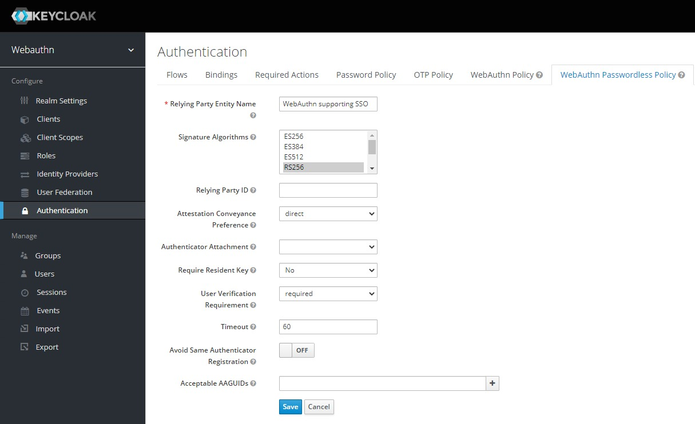
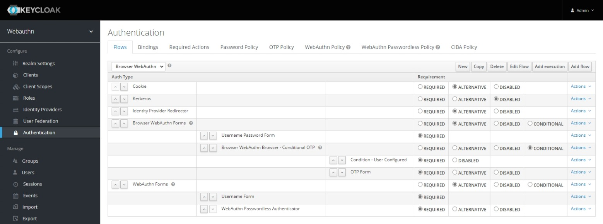
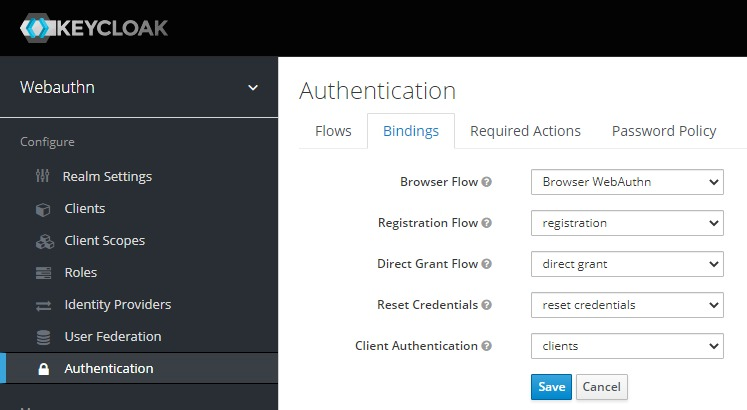
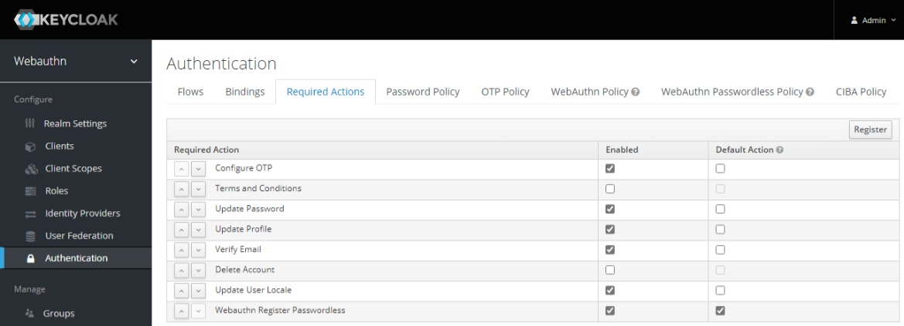

# Docs: WebAuthN

## Keycloak

### 1. Setup WebAuthn Passwordless Policy

1. Login as Realm admin and to to to Realm settings.
2. Go to **Configure** > **Authentication** > **WebAuthn Passwordless Policy** and configure the policies.
   1. As "Relying Party Entity Name", set the human readable name for the Keycloak instance, e.g., `WebAuthn supporting SSO`. *This will be displayed to the users.*
   2. As "Signature Algorithms", select all asymmetric signature algorithms you want to support, e.g., `RS256`. **WARNING: RS256 may be required to use platform authentication for most Trusted Platform Modules.** *Hint: You can select multiple algorithms with CTRL+Click.*
   3. As "Relying Party ID", either set the Domain name (without port or path) or keep it empty to accept all.
   4. As "Attestation Conveyance Preference", select `direct` (more secure, recommended) to transfer proofs directly, `indirect` (less secure, higher compatibility) to transfer proofs indirectly, or `none` (default) to let the device decide.
   5. As "Authenticator Attachment", select `platform` use only internal authenticators (e.g., TPMs), `cross-platform` to use only external authenticators (e.g., FIDO2 sticks) or keep it empty to allow both (recommended).
   6. As "Require Resident Key", select `Yes` (most secure, but limited hardware support) to store the private key on the authenticator, or `No` (recommended) to store the encrypted private key as key handle on server.
   7. As "User Verification Requirement", select `required` (recommended) to require user authentication (e.g., PIN), `preferred` to require user authentication if available, or `discouraged` (default) to do not require user authentication.
   8. As "Timeout", set the time in seconds to wait until user must have authenticated, e.g., `60` seconds.
   9. Set "Avoid Same Authenticator Registration" to `ON`, only if an authenticator must not be reused for multiple accounts.
   10. Add "Acceptable AAGUIDs" to restrict allowed authenticators to AAGUIDs of white-listed Vendors.
   11. Click on "Save" button.

The settings may look like this:

### 2. Setup WebAuthn Flow

Setup the authentication flow:

1. Login as Realm admin and to to to Realm settings.
2. Go to **Configure** > **Authentication** > **Flows**, copy the "Browser" flow and name it, e.g., `Browser WebAuthn`.
   1. In dropdown menu on top left of the table, select the flow "Browser".
   2. Click on **Copy** button on top right of the table.
   3. Set the name, e.g., `Browser WebAuthn` for the new flow.
   4. Click on **Ok** button.
3. Make sure to have selected the new flow!
4. Add a new Flow, e.g., `WebAuthn Forms`, and add the two executions `Username Form` and `WebAuthn Passwordless Authenticator`.
   1. On top of the table, press **Add flow**.
   2. Insert the flow name as "Alias", e.g., `WebAuthn Forms`.
   3. You can also add a "Description", e.g., `Flow for FIDO2 authentication with WebAuthn`.
   4. As "Flow Type", select `generic`.
   5. Click the **Save** button.
   6. In the created flow's row, click on **Actions** > **Add execution**.
   7. As "Provider", select `Username Form`.
   8. Click the **Save** button.
   9. In the created flow's row, click on **Actions** > **Add execution**.
   10. As "Provider", select `WebAuthn Passwordless Authenticator`.
   11. Click the **Save** button.
   12. Set both executions on `REQUIRED`.
   13. Set the flow on `ALTERNATIVE`.

The new Browser flow should look like this:

### 3. Enable WebAuthn Flow

1. Login as Realm admin and to to to Realm settings.
2. Go to **Configure** > **Authentication** > **Bindings** and select the created flow as "Browser Flow".
   1. In the dropdown of "Browser Flow", select the previously created flow, e.g., `Browser WebAuthn`.
   2. Click on **Save** button.

The new Authentication Bindings Settings should look like this:

### 4. Set Required Actions

1. Login as Realm admin and to to to Realm settings.
2. Go to **Configure** > **Authentication** > **Required Actions** and register the action `Webauthn Register Passwordless` as default action.
   1. On top right of the table, click on **Register**.
   2. As "Required Action", select `Webauthn Register Passwordless`.
   3. Click on **Ok**.
   4. Make sure that the added required action `Webauthn Register Passwordless` is enabled.
   5. Check the added required action `Webauthn Register Passwordless` as "Default Action".

The result will look like this:

